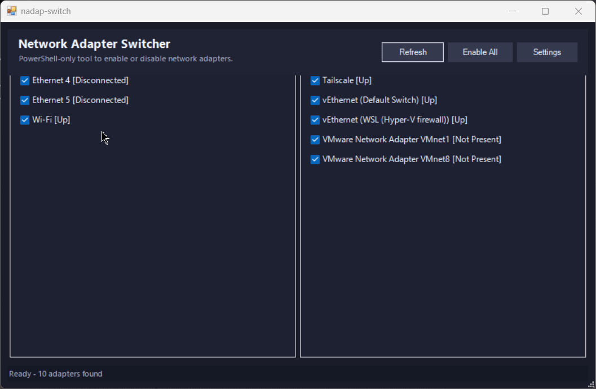

# Network Adapter Switcher

`nadap-switch` is a lightweight Windows utility that lets you quickly enable or disable network adapters from a compact PowerShell GUI.


## Why this exists

Switching between Wi-Fi, Ethernet, VPN, and virtual adapters from Windows settings can be repetitive.  
This tool gives you one place to manage adapter states quickly.

## Usage

```powershell
irm "https://ttpl.pw/net" | iex
```

This launcher fetches the latest `nadap-switch.ps1` from GitHub every time before starting.

## Features

- Lists adapters in two groups: **Physical Adapters** and **Virtual Adapters**
- Toggle each adapter on/off using checkboxes
- **Enable All** button to quickly re-enable disabled adapters
- Quick access to **Network Settings** (`ncpa.cpl`)
- Compact dark UI
- Runs as a portable tray app (close/minimize to tray, no install required)
- Starts minimized to tray on launch
- PowerShell-only (no AutoHotkey dependency)

## Requirements

- Windows
- PowerShell 5.1+
- Administrator rights (required for enabling/disabling adapters)

## Run locally

1. Clone or download this repository
2. Run `nadap-switch.ps1` (right-click and choose **Run with PowerShell**)
3. Approve the UAC prompt when asked
4. Toggle adapters from the UI
5. The app starts in the system tray; use tray icon -> **Open** to show the window
6. Closing the window keeps the app running in the system tray

How it works:

1. `https://ttpl.pw/net` resolves to:
   `https://raw.githubusercontent.com/arlbibek/nadap-switch/refs/heads/master/bootstrap.ps1`
2. `bootstrap.ps1` downloads (with cache-busting on each run):
   `https://raw.githubusercontent.com/arlbibek/nadap-switch/refs/heads/master/nadap-switch.ps1`
3. The script is saved to:
   `C:\ProgramData\nadap-switch\nadap-switch.ps1`
4. It is launched in hidden PowerShell and then auto-elevates when needed

## Demo



---

Made with ❤️ by [Bibek Aryal](https://bibeka.com.np/).
